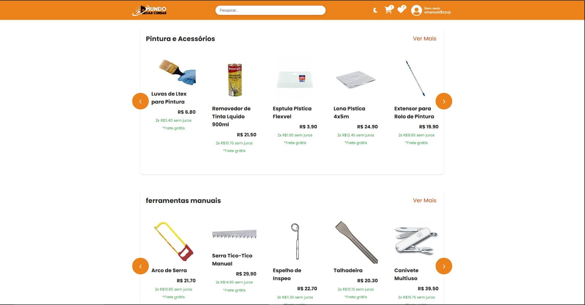

# Portfólio — Emanuel Roque

Site estático, sem build step. Abra `index.html` no navegador ou publique a pasta inteira
(GitHub Pages, Netlify, Vercel — qualquer host de arquivos estáticos serve).

```
index.html
styles.css
script.js
assets/
  images/emanuel-foto.jpg
  fonts/Geist-Variable.woff2, GeistMono-Variable.woff2
  vendor/gsap.min.js, ScrollTrigger.min.js, lenis.min.js
```

Tudo roda offline: fontes e bibliotecas estão embutidas, sem CDN.

## DESING_06 — camada 3D

Esta versão é a DESING_04 com uma camada 3D (Three.js) por cima:

- **Neve de fundo** — ~1.400 flocos num volume 3D, com paralaxe real de profundidade
  na rolagem e no mouse. Liga/desliga no botão ❄ da barra lateral (a escolha fica salva).
- **`</>` de vidro no herói** — extrudado em 3D, iridescente, com cristais de gelo
  orbitando. Segue o mouse, se "abre" quando o cursor chega perto e some ao rolar.
- **Boneco programador no "O que eu faço"** — no vão entre o título e os cards: o
  mascote de óculos, sentado numa cadeira de escritório, digitando num PC. A tela
  mostra código sendo escrito letra por letra (com realce de sintaxe) e as teclas
  acendem no teclado. Clique nele: ele para, olha pra você e acena. A posição é
  medida pelo JS (`layoutCoderDesk`); em telas estreitas ele entra entre o título e
  os cards, e se o vão ficar pequeno demais ele some.
- **Tech stack em bolhas** — cada tecnologia é uma esfera com o logo, com física
  (atração, colisão). O cursor empurra, o clique espalha, o hover mostra o nome.
  A grade de ícones continua embaixo (é ela que tem os links e o texto acessível).
- **Globo de neve no CTA** — o boneco de neve do "Sobre mim" em 3D (mesmas proporções
  e cores do CSS), dentro de um globo. Arrastar gira e agita a neve; clique ou o
  botão "Chacoalhar o globo" (teclado) dão uma sacudida.
- **Ferramentas** — cards com logo, categoria, chips de tecnologia, luz que segue o mouse
  e leve inclinação 3D. O card duplicado do Cervi e Gabriel (já é o projeto 06) saiu, e a
  numeração foi refeita: projetos 01–07, ferramentas 08–15, estudos 16–19.
- **Sala de Estudos** — virou uma estante de livros em 3D (CSS puro, cada livro é um link).
  Passar o mouse, focar pelo teclado ou tocar abre o livro e mostra a capa com a descrição.
- **Bonecos de neve em CSS** — ganharam acabamento (sorriso de carvão, bochechas, cenoura com
  textura, cachecol listrado com franja, faixa no chapéu, galhinhos, neve com brilho e um
  montinho de neve na base) sem mexer em nenhuma animação.
- **Easter egg** — digitar `neve` em qualquer lugar da página faz uma nevasca.

Sem WebGL, o `<html>` recebe `.no-webgl` e as cenas somem sem quebrar nada. Com
`prefers-reduced-motion`, a neve de fundo não é criada e as outras cenas ficam paradas.
Cada cena só é criada quando chega perto da tela e só desenha enquanto está visível.

O código-fonte fica em `src3d/` e é compilado para `assets/vendor/scene3d.min.js`
(que já está pronto — **o site continua sem build step**). Só precisa recompilar se
mexer em `src3d/`:

```
cd src3d
npm install
npm run build        # gera assets/vendor/scene3d.min.js
```

`npm run build:debug` gera uma versão não minificada com um gancho de depuração
(`window.__dbgBalls`) — não publique essa.

---

## Créditos e licenças

O visual foi modelado a partir de **https://www.redoyanulhaque.me/**, cujo código-fonte é
público e MIT (`github.com/red1-for-hek/portfolio-website`, © 2025 Redoyanul Haque). Os
tokens de design — cores, tipografia, escala, animações — foram extraídos do repositório
original, não aproximados de memória. A licença está em `LICENSE-referencia.txt`.

O HTML, o CSS e o JS deste site foram escritos do zero: o original é React + TypeScript +
Three.js com build step, e aqui tudo é estático puro.

| Recurso | Licença |
|---|---|
| Estrutura visual de referência | MIT — `LICENSE-referencia.txt` |
| Geist / Geist Mono (fontes) | SIL OFL 1.1 — `assets/fonts/LICENSE-geist.txt` |
| Lenis (rolagem suave) | MIT — `assets/vendor/LICENSE-lenis.txt` |
| Three.js (camada 3D) | MIT — aviso de licença preservado no fim de `assets/vendor/scene3d.min.js` |
| GSAP + ScrollTrigger | Licença padrão "no charge" da GreenSock — https://gsap.com/standard-license |

**Atenção sobre o GSAP:** a licença gratuita cobre sites como este. Se algum dia você usar
o GSAP num produto em que o usuário final paga pelo acesso (um SaaS, por exemplo), a
GreenSock exige a licença comercial. Vale conferir antes de reaproveitar em cliente.

---

## Tokens de design (extraídos do original)

```css
--accentColor:     #c2a4ff   /* roxo claro, cor de destaque */
--accentDeep:      #7f40ff   /* roxo do gradiente dos títulos */
--accentGlow:      #aa42ff   /* ponto luminoso da timeline */
--backgroundColor: #0b080c   /* fundo quase preto, levemente arroxeado */
--textColor:       #eae5ec
--lineColor:       #363636   /* divisórias entre projetos */
```

Tipografia: **Geist** (variável, 100–900). Títulos de seção em 70px caindo para 36px no
mobile; nome do herói de 28px a 58px conforme o breakpoint.

---

## Efeitos implementados

- **Tela de entrada** com botão preto sobre fundo claro; o site só começa a rolar depois do clique.
- **Cursor customizado** de 50px com `mix-blend-mode: difference`, crescendo ao passar sobre links.
- **Entrada do herói:** nome revelado caractere por caractere com blur e stagger.
- **Cargo em loop:** "DESENVOLVEDOR FULLSTACK" ↔ "SERVIDOR PÚBLICO", um sobe e some enquanto o outro entra por baixo, dentro de uma caixa com `overflow: hidden`.
- **Luzes de fundo:** duas esferas roxas borradas girando, mais o rim light atrás da foto.
- **Navbar `hover-link`:** ao passar o mouse, o texto sobe e um clone entra por baixo.
- **Painéis de atuação** em acordeão, com os cantos em L animados e seta que gira.
- **Projetos em rolagem horizontal** com a seção fixada na tela (pin + scrub do ScrollTrigger).
- **Linha do tempo da carreira** crescendo conforme a rolagem, com ponto luminoso pulsante.
- **Títulos com gradiente** via `background-clip: text`.
- **Boneco de neve:** olhos seguindo o cursor, respiração contínua, pulo nos cliques 1 e 2, desmonte e remonte no 3º, teclado (Enter/Espaço), e virando mascote fixo no canto ao sair do herói.

---

## O que ficou pendente por falta de arquivo

A pasta `assets` chegou vazia no upload (0 bytes). Só a foto subiu. Por isso:

1. **Ícones das tecnologias (SVG).** A seção Stack está com as 32 tecnologias em pastilhas
   de texto. Quando reenviar os SVGs, coloque em `assets/images/` e troque cada item por:
   ```html
   <span class="techstack-item">Python</span>
   ```
   e adicione no CSS: `.techstack-item img{ width:18px; height:18px; margin-right:8px; }`

2. **Screenshots reais.** `mundo-das-coisas-home.jpeg` e `mediaflow-home.png` não vieram.
   Os dois projetos estão com estudo de caso em texto, como manda a regra de conteúdo
   (nada de screenshot fabricado). Para encaixar depois, adicione dentro do `.work-box`:
   ```html
   <div class="work-image"></div>
   ```

3. **`DESING_02`** também não veio, então o boneco de neve foi escrito do zero — mesmo
   comportamento pedido, código novo.

---

## Decisões de conteúdo que valem conferir

- **Tailwind saiu da lista.** O material marcava como "se usado — conferir", e com ele a
  contagem dava 33, não 32. Se você usa mesmo, adicione a pastilha de volta.
- **Projeto 05** ganhou uma nota curta deixando explícito que é um produto *para*
  vereadores (eles são os clientes do SaaS), para nunca confundir com o seu cargo.
- Nenhuma métrica, depoimento, prêmio ou rede social além do GitHub foi adicionado.
- Onde não havia link, está escrito "Sem link público confirmado". O projeto 01 aponta
  para o seu e-mail, não para o GitHub.

---

## Acessibilidade e movimento

- Navegação por teclado com foco visível; link "pular para o conteúdo".
- Boneco de neve é `role="button"` com `tabindex`, respondendo a Enter e Espaço.
- Painéis de atuação abrem por clique/toque, não só por hover.
- `prefers-reduced-motion: reduce` desliga a rolagem suave, as animações do boneco, as
  revelações de scroll e a rolagem horizontal fixada.
- Rastreamento dos olhos e cursor customizado só em `pointer: fine`.
- Se o JS falhar, a tela de entrada some sozinha depois de 6 segundos.

---

## Testado

1440×900, 768×1024 e 390×844 — sem erros de JS e sem overflow horizontal em nenhum deles.

---

## Versão de arquivo único

`portfolio-emanuel-completo.html` é o site inteiro num arquivo só: CSS, JavaScript,
GSAP, ScrollTrigger, Lenis, as duas fontes Geist e a foto, todos embutidos como data URI
ou tag inline. Não depende de nenhum outro arquivo nem de CDN — dá para abrir com duplo
clique, mandar por e-mail ou anexar no WhatsApp e vai funcionar.

Custo: 611 KB contra 552 KB da versão em pasta. O Base64 infla os binários em ~33%, e o
navegador não consegue cachear CSS, JS e fontes separadamente — toda visita rebaixa o
arquivo inteiro.

**Quando usar cada versão:**

- **Publicar de verdade** (GitHub Pages, Netlify, Vercel) → use a versão em pasta.
  Carrega mais rápido, cacheia melhor e é muito mais fácil de editar.
- **Mandar para alguém ver, entregar como trabalho, abrir sem servidor** → use o arquivo único.

### Regerar depois de editar

O arquivo único é gerado, não editado à mão — mexer direto nele significa procurar o CSS
no meio de 600 KB de Base64. Edite `index.html`, `styles.css` e `script.js` normalmente e
rode:

```bash
python3 build-arquivo-unico.py
```

O script embute tudo de novo e avisa se sobrou alguma referência externa.
